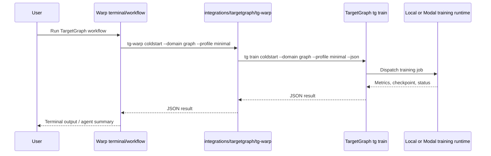

# TargetGraph Training Cockpit Technical Spec

## Context

Warp is a Rust terminal and agentic development environment. The existing repo guidance describes terminal and shell management under `app/`, AI integration under `app/ai/`, Warp Drive under `drive/`, and a Cargo workspace with the main binary in `app/` and UI framework crates under `crates/warpui/`.

For this integration we intentionally avoid changing Warp internals. The first useful TargetGraph connection can be delivered as repository-side orchestration assets:

- `integrations/targetgraph/tg-warp` is a shell bridge invoked from Warp terminals, Warp workflows, and agents.
- `.warp/workflows/*.yaml` define repeatable operator workflows.
- `integrations/targetgraph/README.md` documents setup and the contract expected from TargetGraph.
- `specs/targetgraph-training-cockpit/PRODUCT.md` defines the user-visible behavior.

This approach fits Warp's contribution model because significant features are specified under `specs/`, but it avoids coupling a biomedical training platform to Warp's UI, GraphQL, persistence, or terminal model internals.

## Proposed changes

1. Add `integrations/targetgraph/tg-warp` as a POSIX-compatible bridge script.
   - It resolves a TargetGraph CLI from `TARGETGRAPH_CLI`, `TARGETGRAPH_REPO/.venv/bin/tg`, `TARGETGRAPH_REPO/scripts/targetgraph_train_cli.py`, or `tg` from `PATH`.
   - It wraps common training operations as stable subcommands: `doctor`, `coldstart`, `nyx`, `status`, `promote`, and `passthrough`.
   - It always forwards first-class commands to `tg train ... --json`.

2. Add `integrations/targetgraph/README.md`.
   - Documents setup through `TARGETGRAPH_REPO`.
   - Documents CLI resolution order.
   - Documents the expected TargetGraph-side command contract.
   - Makes explicit that Warp is the cockpit, not the model runtime.

3. Add Warp workflow YAMLs:
   - `.warp/workflows/targetgraph-jepa-coldstart.yaml`
   - `.warp/workflows/targetgraph-nyx-overnight.yaml`
   - `.warp/workflows/targetgraph-campaign-status.yaml`
   - `.warp/workflows/targetgraph-promote-adapter.yaml`

4. Keep the integration external to Warp internals for now.
   - No Rust code changes are needed.
   - No feature flag is needed because the bridge is inert unless invoked.
   - No app persistence or database migration is needed.
   - No terminal model locking risk is introduced.

5. Expected TargetGraph follow-up.
   - TargetGraph should expose a real `tg train` command with the JSON contract documented in the README.
   - If TargetGraph currently only has scripts, it should add a thin CLI facade that delegates to the existing training lake, JEPA, NYX, flywheel, and promotion entrypoints.

## End-to-end flow

## Testing and validation

1. Validate PRODUCT behavior 1-4 by running `integrations/targetgraph/tg-warp doctor` with and without `TARGETGRAPH_REPO` and `TARGETGRAPH_CLI` set.

2. Validate PRODUCT behavior 5 by setting `TARGETGRAPH_CLI` to a fixture script that records arguments and running:
   - `integrations/targetgraph/tg-warp coldstart --domain graph --profile minimal`
   - Expected forwarded args: `train coldstart --domain graph --profile minimal --json`.

3. Validate PRODUCT behavior 6 with the same fixture script and:
   - `integrations/targetgraph/tg-warp nyx --profile standard`
   - Expected forwarded args: `train nyx --profile standard --json`.

4. Validate PRODUCT behavior 7 with:
   - `integrations/targetgraph/tg-warp status --campaign catsper`
   - Expected forwarded args: `train status --campaign catsper --json`.

5. Validate PRODUCT behavior 8-9 with:
   - `integrations/targetgraph/tg-warp promote --campaign catsper --adapter catsper_v1`
   - Expected forwarded args include `--require-pass --json`.
   - Re-run with `--no-require-pass` and verify `--require-pass` is omitted.

6. Validate PRODUCT behavior 10-13 by manually invoking each `.warp/workflows/*.yaml` command line from the repo root and verifying the corresponding bridge command is called.

7. Validate PRODUCT behavior 14-15 by reading the README and running the bridge in a checkout without TargetGraph installed. The script should fail fast and should not install dependencies, clone repositories, or mutate files.

## Risks and mitigations

1. Risk: TargetGraph's actual CLI name or layout differs from the assumed contract.
   - Mitigation: the bridge supports `TARGETGRAPH_CLI` and `passthrough`, and the README documents the expected follow-up contract clearly.

2. Risk: Warp workflow YAML format changes.
   - Mitigation: workflows are plain wrappers around the bridge. The bridge remains usable even if the workflow metadata needs adjustment.

3. Risk: Users expect Warp to manage long-running jobs directly.
   - Mitigation: this spec keeps long-running job ownership in TargetGraph/Modal/local runtime and only returns whatever JSON TargetGraph emits.

## Follow-ups

1. Add a TargetGraph-side `tg train` facade if it does not already exist.
2. Add fixture-based shell tests for `integrations/targetgraph/tg-warp`.
3. Add optional richer Warp UI integration only after the CLI contract is stable.
